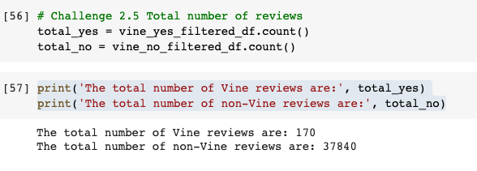
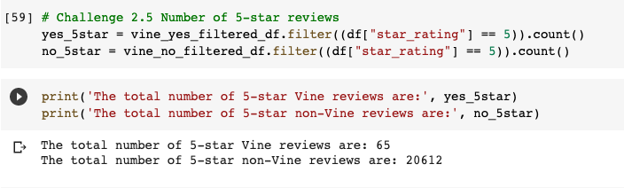
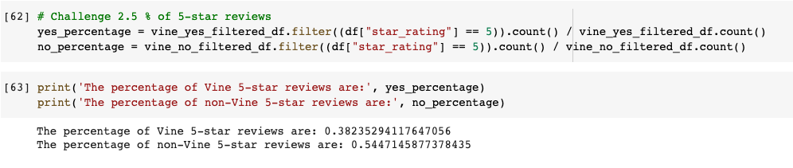

# **Amazon Vine Analysis**

## **Overview**
With our successful SellBy project, Jennifer and I have been tasked with analyzing the paid Amazon Vine program.  Amazon Vine is a program where vendors pay a fee to Amazon and send their products to Vine members who in turn will publish a review. 

For this project, we analyzed a dataset of reviews for pet products.  This is a popular category for Amazon with a vocal consumer base as pet owners want to ensure that they are buying good, quality products for their fur babies! 

Utilizing PySpark, pgAdmin and Amazon Web Services, we performed ETL on the Amazon pet product reviews then determined the bias of Vine reviews vs non-Vine reviews.

## **Results**

1. How many Vine reviews and non-Vine reviews were there?

    - There were a total of **170** Vine reviews and **37,840** non-Vine reviews.

        

2. How many Vine reviews were 5 stars? How many non-Vine reviews were 5 stars?

    - There were **65** Vine reviews that were 5-stars and **20,612** non-Vine reviews that were 5-stars.

        

3. What percentage of Vine reviews were 5 stars? What percentage of non-Vine reviews were 5 stars?

    - **38.2%** of Vine reviews were 5-stars and **54.5%** of non-Vine reviews were 5-stars.

        

## **Summary**

 From the 5-stars review analysis, there does not seem to be a positivity bias for reviews in the Vine program.  Only **38.2%** of Vine reviews came back with 5-star ratings whereas **54.5%** of non-Vine reviews were 5-stars.  

 Another analysis that we can do with the dataset to see if it can further support the statement above is to run the same analysis for 4-star reviews.  Though consumers may have taken a point off for various reasons in their reviews, these reasons are minor as 4-star reviews are still a positive rating for the product.
 
 If the results still show that the percentage of Vine reviews is much less than the non-Vine reviews, then the statement that there does not seem to be a positivity bias for reviews in the Vine program is supported.